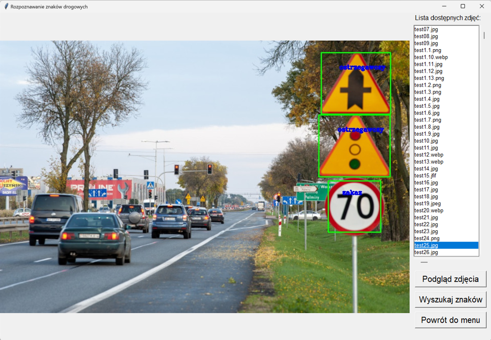
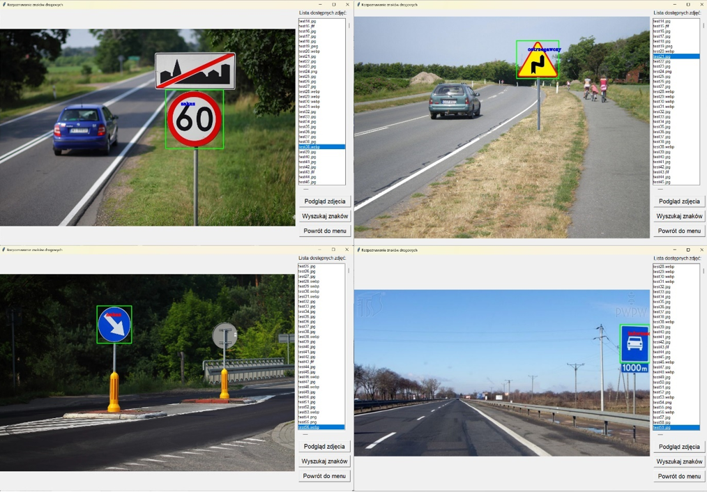
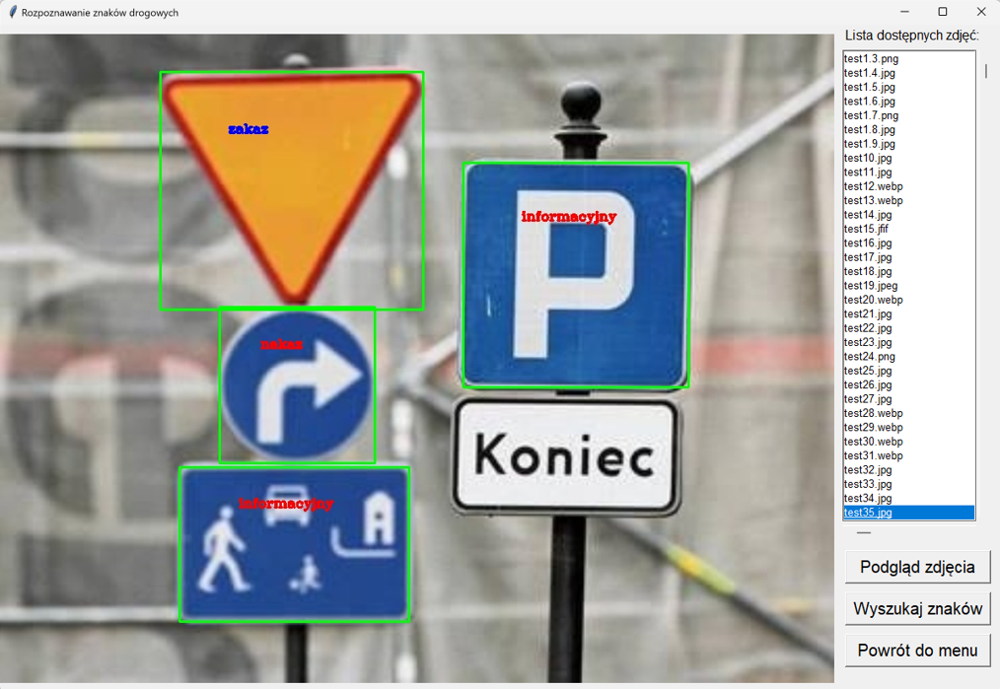
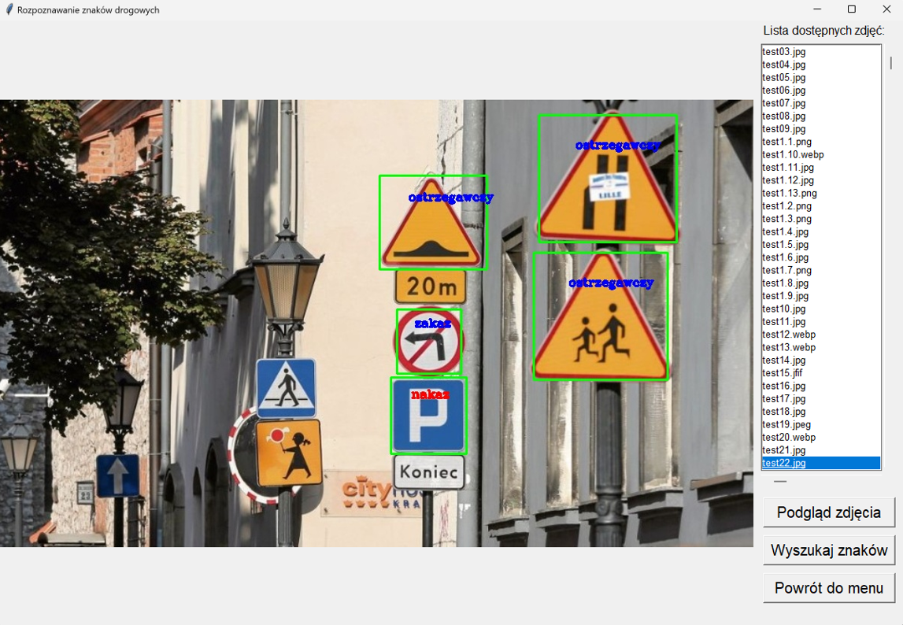
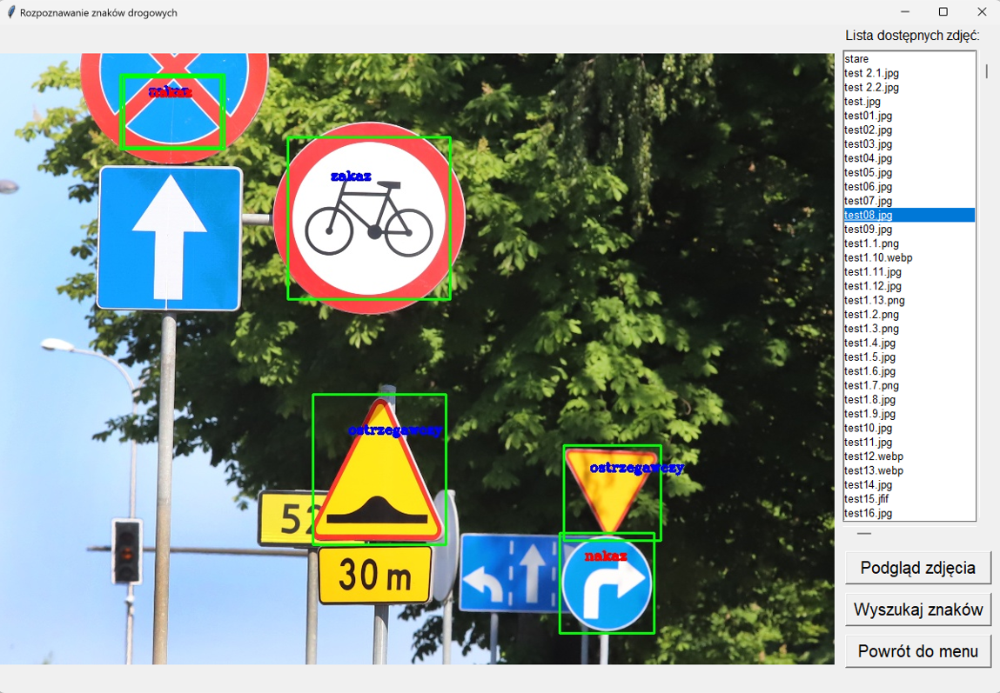
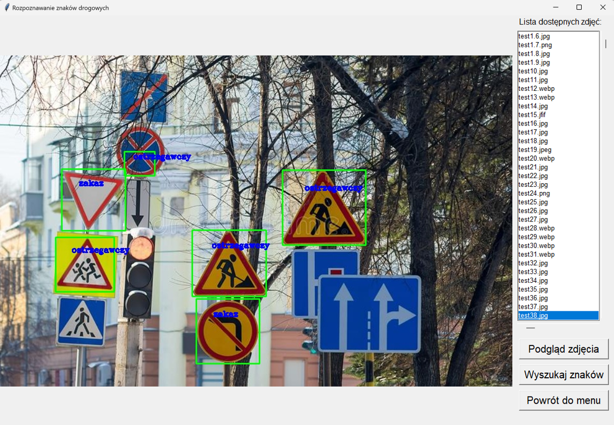

<h1>
Traffic signs recognition
</h1>
The application allows to recognise the type of road sign based on the images taken from the car camera.
The main idea of the project is to use only classical image processing algorithms without using machine learning.

## Description of the applied algorithm
The operation of the algorithm is divided into two parts, the first is sign detection and location and the second is recognition. 
The sign detection process starts with converting the image to the HSV model and then applying the relevant mask for blue and red. 
The red mask allows warning and prohibition signs to be located, as these signs have a red border. 
With a blue filter mask, it is possible to detect a directional and an information sign. Both types of signs have a blue filling and different shapes.
The result is two images to be further processed. These images are then contoured to make it easier to detect the edges of the signs. 
Based on the contours, any figure with a field above a preset value is cut out and then subjected to the recognition of the sign type.
The process of recognising sign types was implemented using template matching. Each obtained slice from the images with masks applied is compared with the corresponding template. 
For the blue mask, this is respectively a rectangle and circle template and for the red mask, a triangle and circle template.

## Example of signs recognition

## Single signs recognition

## Recognition of multiple signs

## Difficult cases

